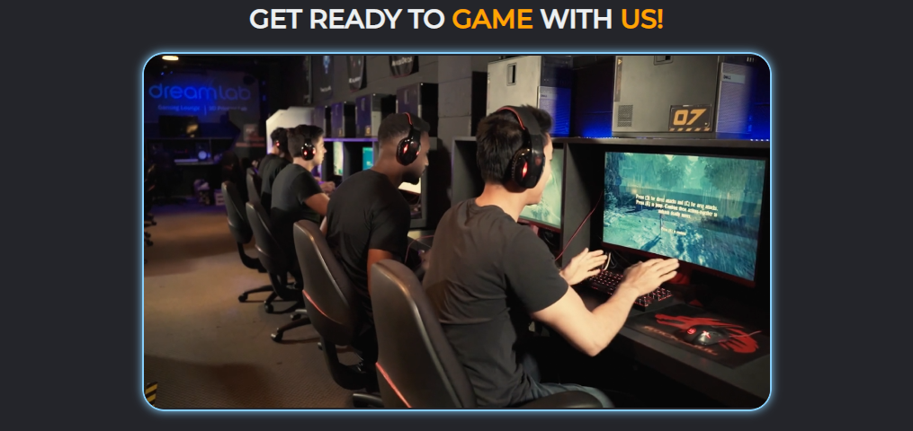
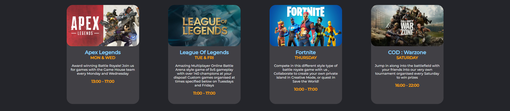
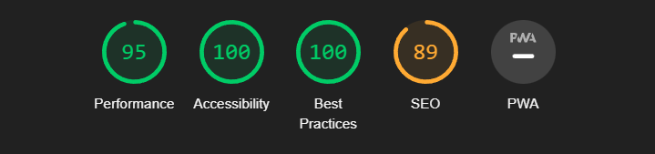

# GAME HOUSE #

Game House is a page aimed at those who are looking for a fun time with video games with friends or get competitive with others. The Game House offers a great and helpful team along with all the neccessary tools from the best computers to the peripherals for that competitive edge.  

Users can see what the Game House can provide in terms of equipment and activites and tournaments held at different times
through the week.

## Features ##

* ### Navigation ###

  * The navigation bar consists of 3 buttons locating to three different stages of the page which is located at the top right of the landing page.

  * All the navigation elements are clear to the user and easy to find.

  * Font theme is consistent throughout the page.

  * Button hovers are interactive and responsive.

  

* ### Header ### 

  * A welcoming Playstation 4 controller themed background image as our landing page main background to notify the user   it's about video game focused website.

  

* ### Video ###

  * Below is a video showing the players readying up for the first gaming session of the day

  

* ### About Us Section ###

  * The about us section consists of the information about our cafe as to where it is located , along with the tournaments and activities that are held.

  * Gives the user important information about the place, if the place is well equipped, with a friendly and helpful team with a focus on improving the whole experience.

  

* ### Cards ### 

  * These here are designed to grab the users attention towards the in-house activites that are held at Game House

  * It provides the user with the brief description of the well known games along with the times the games are on.

  

* ### Contact Form ###

  * This form collects details from the user to send their interest in joining our Game House.

  * It collects the Name, Last Name and Email- Address.

  * It's important for the user to send out the form as to account for how many spaces are available.

  * It also consists of 4 Social Media links to the Game House to find out more about the details from other members.

  

## Testing ## 

  * The website was tested on the Google Chrome, Firefox and Safari browsers with no issues.

  * I confirmed that the website looks good with the colors matching throughout the page.

  * The form works well with the required inputs in all the fields.

  * When resizing the window the cards reposition to fit according to screen size.

  * Feels responsive and smooth.
  

## Bugs ## 

### Solved Bugs ### 

  * 

## Validator Testing ##

* ### HTML ###
  * No errors found during the W3C validator for HTML documents

* ### CSS ###
  * No errors found during the Jigsaw validator for CSS documents

* ### Accessibility ###
  * I have tested the project in the lighthouse devtools that all the colors were chosen well to suit together along with the fonts for easy readability and understanding.

  