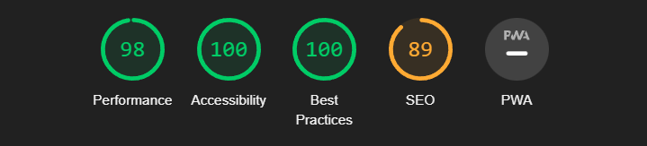

# GAME HOUSE #

Game House is a page aimed at those who are looking for a fun time with video games with friends or get competitive with others. The Game House offers a great and helpful team along with all the neccessary tools from the best computers to the peripherals for that competitive edge.  

Users can see what the Game House can provide in terms of equipment and activites and tournaments held at different times
through the week.

# UX #

## User Stories ##

  * As the site owner I want : 
  
    * The information to be clear
    * Simple to navigate around
    * Not cluttered with too much information

  * As the user, I would want : 

    * To understand what I'm looking for
    * Easily work around the website and navigate information
    * Why would this cafe bring in my interest
    * What would this place have to offer

## 1. Strategy ##

  * Purpose of the Project 
    * Bring together a community of gamers and people that enjoy having a fun time on video games with friends

    * Create activities and tournaments to win prizes

## 2. Scope ## 

  * I wanted a visually grabbing website. 
  * Clean and straightforward.
  * As easy for the user to navigate around the page as possible.
  * Organisation of tournaments and activities
  * Build a great gaming community
  * Mobile device friendly

## 3. Structure ##

* Navigation bar clearly consisting of the Game House logo and Navigation elements that stand out straight away for easy access to different sections on the page.
* Landing page image of a Playstation controller with warm colors ensuring a welcoming feeling into a gaming themed cafe page.
* A video showing a couple of members getting ready to jump into their first session of the day showing a brief look into the Game House.
* About Us section stating all the information neccessary about the Game House, its team and more.
* Tournament/Activity Cards available for all members to join at certain times during the week to win amazing prizes.
* Contact Form to sign up the interest in joining the members of the Game House along with all the Social Media Links.

## 4. Skeleton ## 
I have used a software called Balsamiq Wireframes to construct my initial sketches of the website. I have made initial ideas and work from those wireframes and then updated and adjusted the website as I went forwards with the project.

* Home Page : [Home Sketch](./assets/readme-images/Rough%20Sketch.png)
* About Us : [About Us Sketch](./assets/readme-images/About-us-sketch.png)
* Contact Us : [Contact Sketch](./assets/readme-images/Contact-us-sketch.png)

## 5. Surface ##

 * Theme Selection 
    * When deciding on what color theme to go with I decided to play around with a variety of colors but in the end I've decided to go with an Orange themed page, with blue accents in some areas for text and also grey for other background areas on the page.

  

  * Font Selection 
    * I have decided to go with Montserrat font, that I have chosen from the Google Fonts.

     
# Features #

* ### Navigation ###

  * The navigation bar consists of 4 buttons locating to four different stages of the page which is located at the top right of the landing page.

  * All the navigation elements are clear to the user and easy to find.

  * Font theme is consistent throughout the page.

  * Button hovers are interactive and responsive.

  

* ### Header ### 

  * A welcoming Playstation 4 controller themed background image as our landing page main background to notify the user it's a video game focused website.

  

* ### Video ###

  * Below is a video showing the players readying up for the first gaming session of the day

  

* ### About Us Section ###

  * The about us section consists of the information about our cafe as to where it is located , along with the tournaments and activities that are held.

  * Gives the user important information about the place, if the place is well equipped, with a friendly and helpful team with a focus on improving the whole experience.

  

* ### Cards ### 

  * These here are designed to grab the users attention towards the in-house activites that are held at Game House

  * It provides the user with the brief description of the well known games along with the times the games are on.

  

* ### Contact Form ###

  * This form collects details from the user to send their interest in joining our Game House.

  * It collects the Name, Last Name and Email- Address.

  * It's important for the user to send out the form as to account for how many spaces are available.

  * It also consists of 4 Social Media links to the Game House to find out more about the details from other members.

  

# Testing # 

  * The website was tested on the Google Chrome, Firefox and Safari browsers with no issues.

  * I confirmed that the website looks good with the colors matching throughout the page.

  * The form works well with the required inputs in all the fields.

  * When resizing the window the cards reposition to fit according to screen size.

  * Feels responsive and smooth.

  * Have tested the page on different devices using the Chrome DevTools, working successfully.
  

# Bugs # 

### Solved Bugs ### 

  * Navigation bar buttons were down as a ( a href ) attribute which was not up to the W3C HTML standard. Changing the navigation bar buttons into onclick to move around the page fixed the validation error.

### Unsolved Bugs ###

  * When manually resizing the window the cards don't resize on contact with each other the whole time.

# Validator Testing #

* ### HTML ###
  * No errors found during the W3C validator for HTML documents

* ### CSS ###
  * No errors found during the Jigsaw validator for CSS documents

  * 

    
    

* ### Accessibility ###
  * I have tested the project in the lighthouse devtools that all the colors were chosen well to suit together along with the fonts for easy readability and understanding.

  

# Potential Features #

* ## Sign In Page 
  * Members will be able to sign in to their own account with us and avail of our offers

# Deployment #

* The steps to deploy are as follows:
* In the GitHub repository, navigate to the Settings tab;
* From the source section drop-down menu, select the Master Branch;
* Once the master branch has been selected, the page will be automatically uploaded. The live link can be found <a href="http://gamehouse.com" target="_blank">Game House</a>

# Credits #

### Media ###

I have used resources such as:

* <a href="https://google.com">Google Images</a>

* <a href="https://www.pexels.com/collections/pc-gaming-dmqwt4q/">Pexels</a>

The video used on the webpage was used from Pexels and any other images were supplied from google images.

### Coding ###

I have used the following resources for any help with my coding during the duration of the project :

* <a href="https://stackoverflow.com/">Stack Overflow</a>

* <a href="https://youtube.com">YouTube</a>

* <a href="https://www.w3schools.com/">W3Schools</a>

There was many issues along the way in completing the project , though these sources have helped a ton!

I would also like to thank, <a href="https://codeinstitute.net/ie/">Code Institute</a> in supplying me with the neccessary knowledge to complete this project.

Also my mentor Rahul for his help and guidance throughout the project.